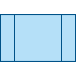

# 工作流可视化设计

## 一、工具栏列表

开始 :  只显示，不可操作

任务:  按住鼠标左键, 可拖到画布中

审核 :  按住鼠标左键, 可拖到画布中

会签 :  按住鼠标左键, 可拖到画布中

判断:  按住鼠标左键, 可拖到画布中

子流程:  按住鼠标左键, 可拖到画布中

并行 :  按住鼠标左键, 可拖到画布中

合并 :   按住鼠标左键, 可拖到画布中

结束 :   只显示，不可操作

直线连接:  点击后, 显示面布中所有节点的连接点(小方框)

折线连接：点击后, 显示面布中所有节点的连接点(小方框)


## 二、控制要求

1. 画布背景网格为10px*10px的方格，背景为白色

2. 新建流程时, 在画布中显示“开始、结束”节点，且不可删除

3. 连接线的约束
   - **开始**  一条出线，多条来自“判断节点”的入线
   - **任务**  一条出线，多条入线
   - **审核**  一条入线，一条出线
   - **会签** 一条入线，一条出线
   - **判断**  一条入线，二条出线（在出线的线条下方显示“是、否”）
   - **子流程**   一条入线，一条出线
   - **并行**   一条入线，多条出线
   - **合并**   多条入线，一条出线
   - **结束**  多条入线

4. 在工具栏中，将【节点图标】与【线条图标】分隔开, 点击线条图标后，将图标置为选中状态，

   并显示出画布中所有元素的线条连接点

5. 点击节点图标及已选中线条图标时，取消线条图标的选中状态，隐藏画布中的线条连接点

6. 在线条连接点上按住鼠标左键不放，方可拖动画线，鼠标放开时，线条必须有目标连接点，

   才生效，否则取消掉已画线条

7. 点击画布中的元素，显示为选中状态

8.  拖动元素，选中框及关联线条同步移动

9.  删除元素，同步删除关联的全部线条


## 三、配置支持

1. 配置节点右键菜单列表

   ```json
   {
       //全部菜单 (格式: {"命令":"描述", ...})
       "menus": {
           "attr": "流程属性",
           "del": "删除节点"
       }，
       //各类型节点的菜单项 (格式: {"节点类型": ['命令', ...]})
       "nodes": {
       	"1": ['attr']
       	"2": ['attr','del']
   	}
   }
   ```

2. 流程配置信息

   ```json
   {
       "code": {
           "name": "节点名称",
           "type": "类型(1-开始、2-任务、3-判断、4-审核、5-会签、4-并行、5-合并、8-子流程、9-结束)",
           "prev": ["上一节点1","上一节点N"],
           "next": ["下一节点1","下一节点N"],
           "view": "流程显示的配置信息，由设计器自行定义"
       }    
   }
   ```

   ​


## 三、事件接口

1.  节点的双击事件
2.  节点的右键菜项项的点击事件 (需回传节点id、菜单命令)
3. 新增节点后的回调
4. 删除节点后的回调


## 四、公共方法

1. 渲染配置信息的流程图
2. 获取流程图的配置信息
3. 删除节点
4. 设置节点名称


